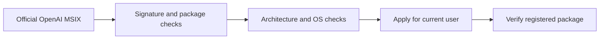

# Codex Windows Store Helper

[English](README.md) · [Русский: быстрый старт](README.ru.md)

Install, update or reapply the official Windows desktop app **without Microsoft Store or WinGet**.
The repository name and script names remain compatible with Codex; current OpenAI documentation calls this the **ChatGPT desktop app**. Its package identity is still `OpenAI.Codex`, Store ID `9PLM9XGG6VKS`.

This project contains helper scripts, not repacks, extracted executables or redistributed app binaries.

[Try without installing](#try-without-installing) · [Install](#install-without-store) · [Troubleshooting](#if-deployment-fails) · [Report a problem](https://github.com/pavelbe/codex-windows-store-helper/issues/new?template=installation.yml) · [MIT license](LICENSE)

**For Windows 11 users whose Store installation or update is stuck.** The default
path downloads the official signed package, verifies it and applies it to the
current user. This is an independent community helper, not an OpenAI or Microsoft product.

| Your goal | Script / option |
| --- | --- |
| Install the desktop app | `Install-Codex.ps1 -OpenApp` |
| Update or reapply its package | `Update-Codex.ps1` / `Reinstall-Codex.ps1` |
| Inspect availability without installing | `Update-Codex.ps1 -CheckOnly` |
| Save and verify a package for later | `Install-Codex.ps1 -DownloadOnly` |



## Try without installing

Download the [source ZIP](https://github.com/pavelbe/codex-windows-store-helper/archive/refs/heads/main.zip),
extract it, then open **Windows PowerShell 5.1** in the extracted directory:

```powershell
powershell.exe -NoProfile -ExecutionPolicy Bypass -File .\scripts\Update-Codex.ps1 -CheckOnly
```

This reads the installed package and requests official download metadata. It does
not download the MSIX, install an app, sign in, or reset any data. Example from a
real x64 check on 2026-09-27 (versions and size will change):

```text
Windows: 10.0.22631.6199; architecture: x64
Installed: 26.924.2738.0; status: Ok
Official package URL: https://persistent.oaistatic.com/codex-app-prod/ChatGPT-x64.msix
Available version (HTTP metadata, not signature proof): 26.924.2738.0; bytes: 876623361
Check-only: no download, installation or data cleanup.
```

Metadata availability does not verify a downloaded package's signature or prove
that installation will succeed. The installer performs those checks separately.

## Install without Store

1. Download this repository using **Code → Download ZIP**, then extract it.
2. Open **Windows PowerShell 5.1** in the extracted directory as your usual Windows user.
3. Run:

```powershell
powershell.exe -NoProfile -ExecutionPolicy Bypass -File .\scripts\Install-Codex.ps1 -OpenApp
```

The helper selects x64/Arm64, downloads the official MSIX, validates its Windows signature, exact package name/publisher, architecture and minimum OS, then calls `Add-AppxPackage`. No Store login, WinGet or web installer is required. Windows AppX deployment and trust/policy services still need to work.

Sources: [OpenAI Windows deployment](https://learn.chatgpt.com/docs/enterprise/windows-deployment), [Microsoft Add-AppxPackage](https://learn.microsoft.com/en-us/powershell/module/appx/add-appxpackage).

Requirements: Windows 11, Windows PowerShell 5.1, inbox `curl.exe`, access to `persistent.oaistatic.com`, and enough disk space for the download and deployment. Current packages exceed 700 MiB. Do not run the installer under a different administrator account: registration is per user.

## Update or reinstall

For a stuck update, apply the current official package directly:

```powershell
powershell.exe -NoProfile -ExecutionPolicy Bypass -File .\scripts\Update-Codex.ps1
```

If the app was removed, or you need to reapply its package:

```powershell
powershell.exe -NoProfile -ExecutionPolicy Bypass -File .\scripts\Reinstall-Codex.ps1 -OpenApp
```

Both use the same verified MSIX deployment path. **Reinstall no longer removes the installed app or deletes local/roaming data before downloading its replacement.** It does not force-close apps, restart WSL, edit permissions/firewall/proxies or reset credentials. Existing `.codex` directories, projects and sessions are not cleanup targets.

Reapplying a package is not a reset of a broken user profile. If a black window remains, collect diagnostics before planning a separate backup/reset. The old destructive `-RemoveRoamingState` option now fails with an explanation.

If Windows reports files in use, save your work and close only the desktop app normally, then retry using the already downloaded package.

## Check, download, or use an existing package

Metadata check only: one HEAD request, no package download or installation:

```powershell
powershell.exe -NoProfile -ExecutionPolicy Bypass -File .\scripts\Update-Codex.ps1 -CheckOnly
```

Download and verify without installing:

```powershell
powershell.exe -NoProfile -ExecutionPolicy Bypass -File .\scripts\Install-Codex.ps1 -DownloadOnly
```

The output contains the MSIX path, verified version, signature status and SHA256. Downloads use a unique directory under `%LOCALAPPDATA%\CodexAppInstaller`. A failed transfer remains `.partial` and is never installed. The download has a 20-second connection timeout and an 8-minute transfer timeout; retry explicitly on a slow or failed connection.

Use a previously downloaded complete MSIX without another download:

```powershell
powershell.exe -NoProfile -ExecutionPolicy Bypass -File .\scripts\Install-Codex.ps1 -PackagePath "C:\Downloads\ChatGPT-x64.msix" -CheckOnly
powershell.exe -NoProfile -ExecutionPolicy Bypass -File .\scripts\Install-Codex.ps1 -PackagePath "C:\Downloads\ChatGPT-x64.msix" -OpenApp
```

Replace the example path with the path printed by the downloader. Each invocation verifies the package again; SHA256 identifies the local file, while Windows signature validation establishes trust. The helper holds a read lease across verification and deployment, rejects downgrades, and confirms a healthy registered package afterward. That confirmation does not prove login or UI behavior.

Official stable download links:
- [x64 MSIX](https://persistent.oaistatic.com/codex-app-prod/ChatGPT-x64.msix)
- [Arm64 MSIX](https://persistent.oaistatic.com/codex-app-prod/ChatGPT-arm64.msix)

These links change contents as OpenAI publishes releases. The helper does not pin an old version. As checked on **2026-09-15**, the x64 package is `26.903.8094.0`, signed for publisher `CN=50BDFD77-8903-4850-9FFE-6E8522F64D5B`, with no external AppX package dependencies in its manifest. Future dependencies are checked and reported rather than downloaded from unofficial sources.

For enterprise provisioning, follow OpenAI's separate offline-license/MDM guidance. This helper installs for the current user; it does not provision all users.

## If deployment fails

| Error | What to do |
| --- | --- |
| `0x80070005`, `windows.firewall` | Read the AppX ActivityId and check BFE, mpssvc, EventLog and AppXSvc. Access denied alone does not prove missing administrator membership. Do not grant Everyone access or disable UAC/firewall. |
| `0x80073D02` | Save work, close the desktop app normally and retry the same MSIX. |
| `0x80073CF3` | Check the named dependency/conflicting package in the deployment log. |
| `0x80073D06` | A newer version is installed; do not force a downgrade. |
| Signature/identity rejection | Download again from the official source. Never bypass signature verification or import a certificate just to silence the check. |
| Download timeout/network error | Retry the download or transfer a complete official signed package from another machine, then use `-PackagePath`. |

The helper preserves the original deployment error and prints service status. For an ActivityId from that error:

```powershell
Get-AppPackageLog -ActivityID '<ActivityId from the failed deployment>'
Get-Service EventLog,BFE,mpssvc,AppXSvc
```

Windows membership, elevation of this PowerShell process, service ACLs and app-deployment policy are separate checks. Normal per-user installation does not justify broad rights changes.

No script can guarantee success when Windows deployment policy/services or the network are broken. This flow avoids the Store distribution dependency; it does not bypass Windows security.

## Legacy Store diagnostics

The existing diagnostics remain available:

```powershell
powershell.exe -NoProfile -ExecutionPolicy Bypass -File .\scripts\Get-CodexStoreStatus.ps1 -HistoryDays 7
powershell.exe -NoProfile -ExecutionPolicy Bypass -File .\scripts\Get-CodexAppDoctor.ps1 -HistoryDays 7 -MaxHistoryEvents 12
```

The doctor reports Store/catalog/changelog observations; a catalog version is not a successful install. Explicitly select the old Store path only when you need it:

```powershell
powershell.exe -NoProfile -ExecutionPolicy Bypass -File .\scripts\Update-Codex.ps1 -Source Store
powershell.exe -NoProfile -ExecutionPolicy Bypass -File .\scripts\Install-Codex.ps1 -Source Store
```

Legacy Store mode still requires WinGet and Microsoft distribution services. Its update flow retains the `upgrade → install --force` fallback. Store-only proxy/cache repair remains an explicit operation through `Repair-StoreNetwork.ps1`; direct installation never invokes it.

Check proxy settings separately: disabling the user proxy in Windows Settings does not clear WinHTTP or WinGet's administrator `DefaultProxy`.

```powershell
netsh winhttp show proxy
winget settings export
```

If these show a retired proxy and direct access works, an elevated PowerShell can clear those two settings:

```powershell
netsh winhttp reset proxy
winget settings reset --setting DefaultProxy
```

Record the old values first. Do not reset a required corporate proxy or re-enable an old loopback proxy merely because Store fails. These commands change network settings; they do not reinstall the app or repair deployment permissions. The installer itself never changes proxy settings.

## Automatic updates

According to [OpenAI](https://learn.chatgpt.com/docs/enterprise/windows-deployment), the directly installed app can update through `persistent.oaistatic.com` unless managed policy disables its built-in updater. See [update policy](https://learn.chatgpt.com/docs/enterprise/manage-app-updates). This helper does not edit those policies. When automatic updating fails, rerun `Update-Codex.ps1`.

## Verification and maintenance

The direct installer is also used by HCA. Before transferring an update, compare
`scripts/Install-CodexDirect.ps1` with HCA's
`windows/tools/Install-CodexDirect.ps1`; keep the copies identical and run the
offline suite below. HCA launchers and account-switching scripts have additional
local dependencies and are not interchangeable with this Windows installer.

For a separate read-only terminal tool that lists existing reset-credit deadlines,
see [codex-reset-status](https://github.com/pavelbe/codex-reset-status) (Linux/WSL).
It reads a local auth file but does not switch accounts or consume resets. Never
attach that file or account-switcher backups to this repository or an issue.

```powershell
powershell.exe -NoProfile -ExecutionPolicy Bypass -File .\tests\Smoke-Test.ps1
```

This is an **offline** suite: PowerShell parsing, malformed/untrusted/wrong-architecture package checks, downgrade and false-success rejection, non-mutating check/download modes, and a failed-download reinstall regression. OS signing, deployment and network effects are doubled; tests neither install applications nor reset Store state. Unlike the old smoke script, it never invokes real install/update flows as a test.

The suite also checks live/closed loopback-proxy probe results with a network
double. The probe keeps `-Host` compatibility without assigning PowerShell's
read-only `$Host` automatic variable.

The data-preservation regression was run against the previous reinstall implementation: a simulated download failure occurred after app removal and session-directory deletion. The same assertion passes with the new implementation. Real x64 package download/signature/manifest verification is separate evidence; installation and launch on a clean machine remain manual checks. Arm64 execution is not yet manually verified.

Canonical direct installer: `scripts/Install-CodexDirect.ps1`. HCA vendors an exact copy at `windows/tools/Install-CodexDirect.ps1`; update both together and compare bytes. Keep app downloads, authentication, session data and private diagnostic logs outside this public repository. Run checks locally; do not add GitHub Actions.

If this helper is useful, a GitHub star helps other users find it.
